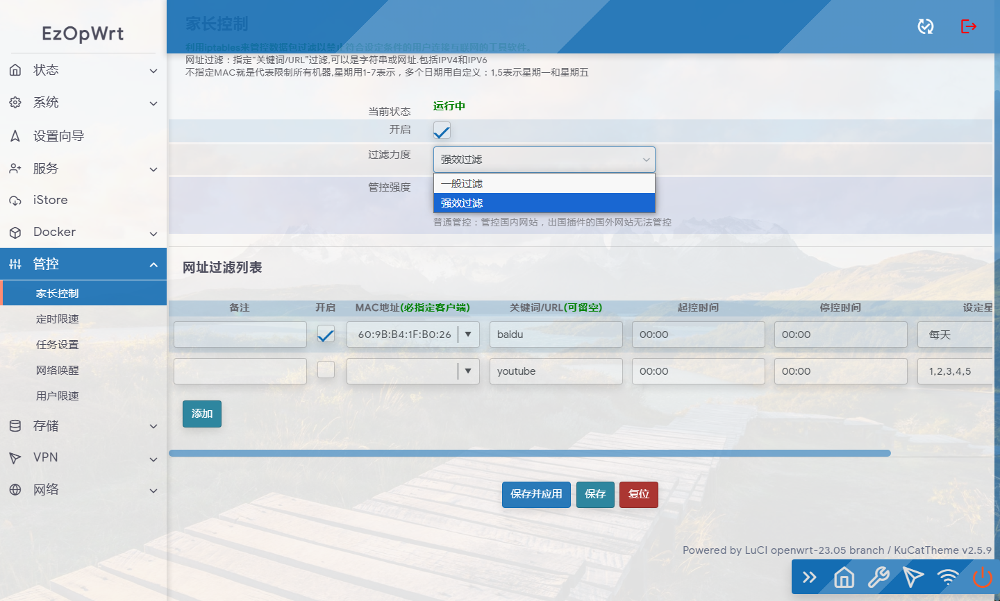
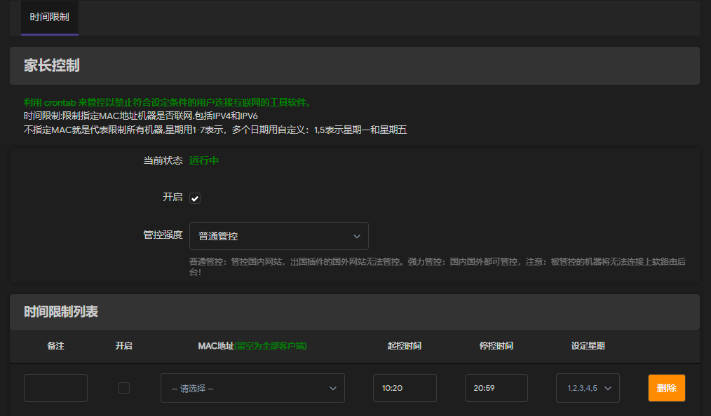

# luci-app-parentcontrol

[原作者点此访问](https://github.com/sirpdboy/luci-app-parentcontrol)

以下内容为原程序介绍：

家长控制 ，可以按时间控制机器，端口和关键字过滤等。

本家长控制，是2022年群里某生找本人出钱定制界面开发，代码原来网上开源代码只是不符合要求，请本人二次开发，现经和需求方协议将代码开源！以感谢大家的支持与鼓励！！也算是为OPENWRT开源代码添砖加瓦！

当然，本身这代码也不是一个什么很高级的代码，权当是抛砖引玉，如果有什么不足之处，欢迎一起ISSE使之更完善。

最初版本参考Lienol大的网址过滤源码和参考部分网上开源代码而来。

参考来源：
https://github.com/Lienol/openwrt-package/tree/main/luci-app-control-weburl

## 界面

## 改进内容

1.使用自定义系统 crontab 中的计划任务来管理，去除iptables
2.后期会修改网址过滤与协议过滤功能

- [x] crontab时间控制
- [] 网址过滤修改
- [] 协议过滤修改

## 修改后界面

